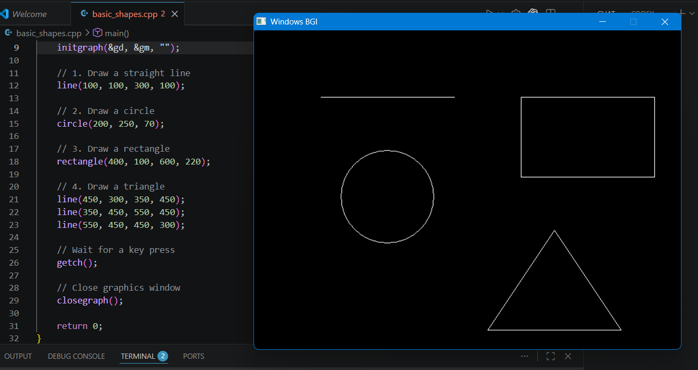

# CGM Lab Assignment 1 - Basic Shapes

## Objective

To understand and implement basic graphics primitives using C++ and the graphics.h library.

## Shapes Drawn

The program draws the following basic graphics primitives:

1. Straight Line
2. Circle
3. Rectangle
4. Triangle

## Technologies Used

- C++
- graphics.h

## Output

The output of the program is shown below:

